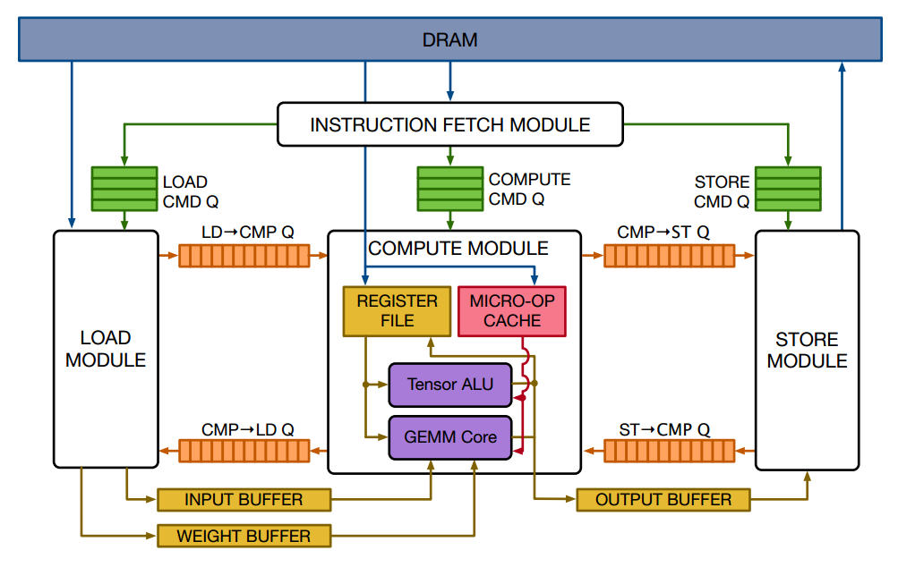
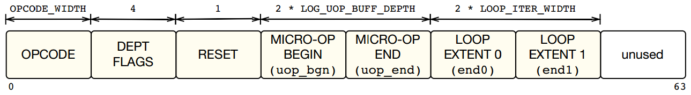
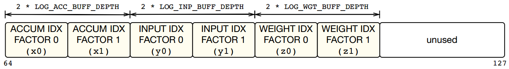
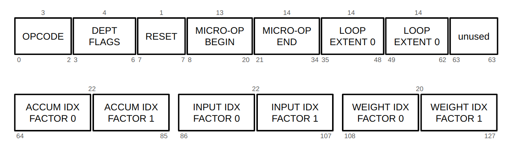
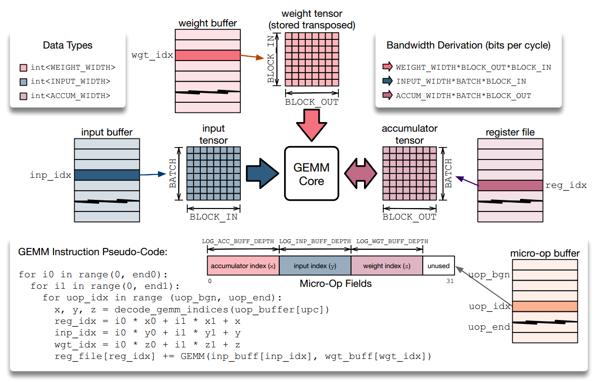
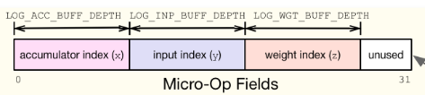

<!--
Filename: GEMM.md  
Description:
-->


<!------------------- begin of section 1 -------------------->

# 1&ensp;VTA Hardware Overview

<center>
  
</center>

## 1.1&ensp;Modules

### fetch module
- The **fetch module** loads task instructions from DRAM and dispatches them, according to the instruction type, to the corresponding command queues connected to load, compute, and store modules.

### load module

- The **load module** loads input, weight, and bias tensor tiles from DRAM into on-chip memories.


### compute module

- The **compute module** loads a micro-coded kernel from DRAM into on-chip memory. Micro-coded kernels are based on microops that describe data access patterns for inputs, weights, and biases.

- The **compute module** executes the micro-coded kernel to perform either a dense linear algebra computation via the GEMM core or a pairwise arithmetic operations via the Tensor ALU.

- **Tensor ALU**
  - The **tensor ALU** performs <u>element-wise tensor operations</u> such as (1) addition, (2) activation, (3) normalization, and (4) pooling tasks.

- **GEMM Core**
  - The **GEMM core** performs high-arithmetic intensity <u>matrix multiplication over input and weight tensors</u> to implement common deep learning operators such as 2D convolutions, or fully connected layers.


### store module

- The store module reads results processed by the compute module and writes them to DRAM.


<!-------------------- end of section 1 --------------------->

<br>

<br>

<!------------------- begin of section 2 -------------------->

---

# 2&ensp;GEMM Core

## 2.1&ensp;GEMM Instructio for Zedboard

### GEMM Instruction

<center>
  
  
</center>

<br>

### Bit Length for Each Field

- **`OPCODE`** = 3
  - `VTA_OPCODE_BIT_WIDTH` = 3

<br>

- **`LOG_UOP_BUFF_DEPTH`**  _(log2 of on-chip micro-op buffer depth)_
  
  = `VTA_LOG_UOP_BUFF_SIZE` - `VTA_LOG_UOP_WIDTH` + 3
  
  = 15 - 5 + 3
  
  = **13**
  
  - `VTA_LOG_UOP_WIDTH` = 5  _(log2 of micro op data type width)_
  - `LOG_UOP_BUFF_SIZE` = 15

<br>

- **`LOOP_ITER_WIDTH`** _(GEMM/ALU Instruction: loop max iter bits)_
  
  = **14**

<br>

- **`LOG_ACC_BUFF_DEPTH`** _(log2 of on-chip accumulator buffer depth)_
  
  = `VTA_LOG_ACC_BUFF_SIZE` - `VTA_LOG_BATCH` - `VTA_LOG_BLOCK_OUT` - `VTA_LOG_ACC_WIDTH` + 3
  
  = 17 - 0 - 4 - 5 + 3
  
  = **11**
  
  - `LOG_ACC_WIDTH` = 5
  - `LOG_BATCH` = 0
  - `LOG_BLOCK` = 4
  - `LOG_ACC_BUFF_SIZE` = 17

<br>

- **`LOG_INP_BUFF_DEPTH`** _(log2 of activation micro-op buffer depth)_
  
  = `VTA_LOG_INP_BUFF_SIZE` - `VTA_LOG_BATCH` - `VTA_LOG_BLOCK_IN` - `VTA_LOG_INP_WIDTH` + 3
  
  = 15 - 0 - 4 - 3+ 3
  
  = **11** 
  
  - `LOG_INP_WIDTH` = 3
  - `LOG_BATCH` = 0
  - `LOG_BLOCK` = 4
  - `LOG_INP_BUFF_SIZE` = 15

<br>

- **`VTA_LOG_WGT_BUFF_DEPTH`** _(log2 of weight micro-op buffer depth)_
  
  = `VTA_LOG_WGT_BUFF_SIZE` - `VTA_LOG_BLOCK_OUT` - `VTA_LOG_BLOCK_IN` - `VTA_LOG_WGT_WIDTH` + 3
  
  = 18 - 4 - 4 - 3 + 3
  
  = **10**
  
  - `LOG_WGT_WIDTH` = 3
  - `LOG_BATCH` = 0
  - `LOG_BLOCK` = 4
  - `LOG_WGT_BUFF_SIZE` = 18

<br>

**lower side (0 ~ 63)**

| Field Name             | Bit Size | Symbol                |
| ---------------------- | -------- | --------------------- |
| `OPCODE`               | 3        | -                     |
| `DEPT FLAGS`           | 4        | -                     |
| `RESET`                | 1        | -                     |
| `MICRO-OP BEGIN ~ END` | 27       | `uop_bgn` / `uop_end` |  
| `LOOP EXTENT 0 ~ 1`    | 28       | `end0` / `end1`       |

<br>

**upper side (64 ~ 127)**

| Field Name                | Bit Size | Symbol      |
| ------------------------- | -------- | ----------- |
| `ACCUM IDX FACTOR 0 ~ 1`  | 22       | `x0` / `x1` |
| `INPUT IDX FACTOR 0 ~ 1`  | 22       | `y0` / `y1` |
| `WEIGHT IDX FACTOR 0 ~ 1` | 20       | `z0` / `z1` |

<br>

<center>
  
</center>

<br>

## 2.2&ensp;GEMM Core Operations

<center>
  
</center>

<!-------------------- end of section 2 --------------------->

<br>

<br>

<!------------------- begin of section 3 -------------------->

---

# 3&ensp;GEMM Core with HLS codes

## 3.1&ensp;compute

### compute module
Reads in GEMM instructions from the gemm queue, and performs appropriate GEMM/ALU instructions. Reads in data from the `wgt_mem` and `inp_mem`, and writes computation results into the `out_mem`. Updates dependence queues accordingly.

- `done` Signal that indicates that VLA is done. (AXI-lite memory mapped register)
- `uops` Micro-op data base address in DRAM. (AXI-4 master port)
- `biases` Bias data base address in DRAM. (AXI-4 master port)
- `gemm_queue` GEMM instruction queue. (AXI-stream FIFO)
- `l2g_dep_queue` Dependence queue from load to gemm stage. (AXI-stream FIFO)
- `s2g_dep_queue` Dependence queue from store to gemm stage. (AXI-stream FIFO)
- `g2l_dep_queue` Dependence queue from gemm to load stage. (AXI-stream FIFO)
- `g2s_dep_queue` Dependence queue from gemm to store stage. (AXI-stream FIFO)
- `inp_mem` Local input SRAM buffer. (Read only single port BRAM)
- `wgt_mem` Local weight SRAM buffer. (Read only single port BRAM)
- `out_mem` Local output SRAM buffer. (Write only single port BRAM)


### head
```cpp
void compute(
  volatile uint32_t &done,
  volatile uop_T *uops,
  volatile bus_T *biases,
  hls::stream<insn_T> &gemm_queue,
  hls::stream<bool> &l2g_dep_queue,
  hls::stream<bool> &s2g_dep_queue,
  hls::stream<bool> &g2l_dep_queue,
  hls::stream<bool> &g2s_dep_queue,
  bus_T inp_mem[VTA_INP_BUFF_DEPTH][INP_MAT_AXI_RATIO],
  bus_T wgt_mem[VTA_WGT_BUFF_DEPTH][WGT_MAT_AXI_RATIO],
  bus_T out_mem[VTA_ACC_BUFF_DEPTH][OUT_MAT_AXI_RATIO]);
```

### compute module code
```cpp
void compute(
  volatile uint32_t &done,
  volatile uop_T *uops,
  volatile bus_T *biases,
  hls::stream<insn_T> &gemm_queue,
  hls::stream<bool> &l2g_dep_queue,
  hls::stream<bool> &s2g_dep_queue,
  hls::stream<bool> &g2l_dep_queue,
  hls::stream<bool> &g2s_dep_queue,
  bus_T inp_mem[VTA_INP_BUFF_DEPTH][INP_MAT_AXI_RATIO],
  bus_T wgt_mem[VTA_WGT_BUFF_DEPTH][WGT_MAT_AXI_RATIO],
  bus_T out_mem[VTA_ACC_BUFF_DEPTH][OUT_MAT_AXI_RATIO]) {
... 
pragma ~
... 

  // Micro-op storage ---> Micro-op Cache
  static uop_T uop_mem[VTA_UOP_BUFF_DEPTH];

  // Accumulator storage ---> Register File
  static bus_T acc_mem[VTA_ACC_BUFF_DEPTH][ACC_MAT_AXI_RATIO];
#pragma HLS ARRAY_RESHAPE variable = acc_mem complete dim=2
  // This is necessary to obtain II=1
#pragma HLS DEPENDENCE variable = acc_mem inter false

  // Pop GEMM instruction
  insn_T raw_insn = gemm_queue.read();
  // Cast to GenericInsn
  VTAInsn insn;
  insn_T raw_copy = raw_insn;
  insn.generic = *((VTAGenericInsn *) &raw_copy);

  // Pop dependence token if instructed
  ...(생략)...

  // Set done value
  done = 0;
  // Perform action based on opcode
  if (insn.generic.opcode == VTA_OPCODE_FINISH) {
    // Set done flag if we reach a FINISH instruction
    done = 1;
  } else if (insn.generic.opcode == VTA_OPCODE_LOAD) {
    ...
  } else if (insn.generic.opcode == VTA_OPCODE_GEMM) {
    gemm(raw_copy, uop_mem, acc_mem, inp_mem, wgt_mem, out_mem);
  } else if (insn.generic.opcode == VTA_OPCODE_ALU) {
    alu(raw_copy, uop_mem, acc_mem, inp_mem, wgt_mem, out_mem);
  }

  // Push dependence token if instructed
  ...(생략)...
}
```

### Parameters into gemm

```cpp
gemm(
  raw_copy, // gemm queue로 부터 가져온 gemm instruction
//----------------------------------------------------
  uop_mem,  // micro-op cache
  acc_mem,  // register file
//----------------------------------------------------
  inp_mem,  // input memory
  wgt_mem,  // weight memory 
  out_mem   // output memory
);
```

## 3.2&ensp;gemm

### head
```cpp
void gemm(
  insn_T insn_raw, // gemm instruction
  uop_T uop_mem[VTA_UOP_BUFF_DEPTH], // micro-op cache
  bus_T acc_mem[VTA_ACC_BUFF_DEPTH][ACC_MAT_AXI_RATIO], // register file
  bus_T inp_mem[VTA_INP_BUFF_DEPTH][INP_MAT_AXI_RATIO], // input memory 
  bus_T wgt_mem[VTA_WGT_BUFF_DEPTH][WGT_MAT_AXI_RATIO], // weight memory
  bus_T out_mem[VTA_ACC_BUFF_DEPTH][OUT_MAT_AXI_RATIO]  // output memory
)
```

### gemm code

```cpp
void gemm(
  insn_T insn_raw,
  uop_T uop_mem[VTA_UOP_BUFF_DEPTH],
  bus_T acc_mem[VTA_ACC_BUFF_DEPTH][ACC_MAT_AXI_RATIO],
  bus_T inp_mem[VTA_INP_BUFF_DEPTH][INP_MAT_AXI_RATIO],
  bus_T wgt_mem[VTA_WGT_BUFF_DEPTH][WGT_MAT_AXI_RATIO],
  bus_T out_mem[VTA_ACC_BUFF_DEPTH][OUT_MAT_AXI_RATIO]) {
#pragma HLS INLINE

  VTAGemInsn insn = *((VTAGemInsn *) &insn_raw);

  // Loop offset
  acc_idx_T dst_offset_out = 0;
  inp_idx_T src_offset_out = 0;
  wgt_idx_T wgt_offset_out = 0;

  // Outer Loop
  EXE_OUT_LOOP: for (int it_out = 0; it_out < insn.iter_out; it_out++) {
    acc_idx_T dst_offset_in = dst_offset_out;
    inp_idx_T src_offset_in = src_offset_out;
    wgt_idx_T wgt_offset_in = wgt_offset_out;

    // Inner Loop
    EXE_IN_LOOP: for (int it_in = 0; it_in < insn.iter_in; it_in++) {

      // Iterate over micro op
      READ_GEMM_UOP: for (int upc = insn.uop_bgn; upc < insn.uop_end; upc++) {
#pragma HLS PIPELINE II = 1
        // Read micro-op fields
        uop_T uop = uop_mem[upc];

        // Decode indices
        acc_idx_T dst_idx =
            uop.range(VTA_UOP_GEM_0_1, VTA_UOP_GEM_0_0) + dst_offset_in;
        inp_idx_T src_idx =
            uop.range(VTA_UOP_GEM_1_1, VTA_UOP_GEM_1_0) + src_offset_in;
        wgt_idx_T wgt_idx =
            uop.range(VTA_UOP_GEM_2_1, VTA_UOP_GEM_2_0) + wgt_offset_in;

        // Read in weight tensor
        wgt_T w_tensor[VTA_BLOCK_OUT][VTA_BLOCK_IN];
        read_tensor<bus_T, wgt_T, wgt_idx_T, VTA_BUS_WIDTH, VTA_WGT_WIDTH, VTA_BLOCK_OUT, VTA_BLOCK_IN>(wgt_idx, wgt_mem, w_tensor);
        // Read in input tensor
        inp_T i_tensor[VTA_BATCH][VTA_BLOCK_IN];
        read_tensor<bus_T, inp_T, inp_idx_T, VTA_BUS_WIDTH, VTA_INP_WIDTH, VTA_BATCH, VTA_BLOCK_IN>(src_idx, inp_mem, i_tensor);
        // Read in accum tensor
        acc_T a_tensor[VTA_BATCH][VTA_BLOCK_OUT];
        read_tensor<bus_T, acc_T, acc_idx_T, VTA_BUS_WIDTH, VTA_ACC_WIDTH, VTA_BATCH, VTA_BLOCK_OUT>(dst_idx, acc_mem, a_tensor);
        // Output tensor
        out_T o_tensor[VTA_BATCH][VTA_BLOCK_OUT];

        // Inner GEMM loop
        for (int b = 0; b < VTA_BATCH; b++) {
          for (int oc = 0; oc < VTA_BLOCK_OUT; oc++) {
            // Initialize the accumulator values
            acc_T accum = a_tensor[b][oc];
            // Dot product sum
            sum_T tmp = 0;
            // Inner matrix multiplication loop (input channel/feature)
            for (int ic = 0; ic < VTA_BLOCK_IN; ic++) {
              wgt_T w_elem = w_tensor[oc][ic];
              inp_T i_elem = i_tensor[b][ic];
              mul_T prod_dsp = i_elem * w_elem;
              tmp += (sum_T) prod_dsp;
            }
            // Update summation
            accum += (acc_T) tmp;
            // Write back result acc_mem
            a_tensor[b][oc] = insn.reset_reg ? (acc_T) 0 : accum;
            // And output vector
            o_tensor[b][oc] = (out_T) accum.range(VTA_OUT_WIDTH - 1, 0);
          }
        }

        // Write the results back into accumulator
        write_tensor<bus_T, acc_T, acc_idx_T, VTA_BUS_WIDTH, VTA_ACC_WIDTH, VTA_BATCH, VTA_BLOCK_OUT>(dst_idx, a_tensor, acc_mem);
        // Write the results back in the output buffer
        write_tensor<bus_T, out_T, acc_idx_T, VTA_BUS_WIDTH, VTA_OUT_WIDTH, VTA_BATCH, VTA_BLOCK_OUT>(dst_idx, o_tensor, out_mem);
      }
      // Update offsets
      dst_offset_in += insn.dst_factor_in;
      src_offset_in += insn.src_factor_in;
      wgt_offset_in += insn.wgt_factor_in;
    }
    // Update offsets
    dst_offset_out += insn.dst_factor_out;
    src_offset_out += insn.src_factor_out;
    wgt_offset_out += insn.wgt_factor_out;
  }
}
```

<br>

### operation

- instruction and micro-code

<center>
  
  
  
</center>

#### outer loop
1. GEMM instruction에서 `iter_out`(= `end0`)에 해당하는 수만큼 내부 루프를 반복한다.

2. 내부 루프가 완료된 이후에 각 outer loop offset을 증가
   - `insn.dst_factor_out` : `x0` >> `x0` 만큼 증가
   - `insn.src_factor_out` : `y0` >> `y0` 만큼 증가 
   - `insn.wgt_factor_out` : `z0` >> `z0` 만큼 증가

<br>

#### inner loop
1. GEMM instruction에서 `iter_in`(= `end1`)에 해당하는 수만큼 micro-op를 수행한다.

2. micro-op가 완료된 이후에 각 inner loop offset을 증가
   - `insn.dst_factor_in` : `x1` >> `x1` 만큼 증가
   - `insn.src_factor_in` : `y1` >> `y1` 만큼 증가
   - `insn.wgt_factor_in` : `z1` >> `z1` 만큼 증가

<br>

#### iterate over micro-op
  
1. micro-op cache(buffer)로부터 upc(micro-op program counter)가 가리키는 곳의 micro-op 코드를 가져온다. 
   - pc의 범위 : (value of `uop_bgn` field) ~ (value of `uop_end` field
<br>

2. micro-op code로부터 index를 디코드한다.
   - `dst_idx` (register file index) = `x` = \[10:0] micro-op (11 bits) + `dst_offset_in`
   - `src_idx` (input buffer index) = `y` = \[21:11] micro-op (11 bits) + `src_offset_in`
   - `wgt_idx` (weignt buffer index) = `z` = \[31:22] micro-op (10 bits) + `wgt_offset_in`
<br>

3. Buffer로부터 텐서를 레지스터로 읽어온다.
   - `w_tensor` : weight tensor register
   - `i_tensor` : input tensor register
   - `a_tensor` : accumulator tensor register
   - `o_tensor` : output tensor register
<br>

4. Inner GEMM loop를 실행한다.
   - matrix multiplication 연산을 수행
   - summation 연산 수행
   - 연산 결과를 a_tensor와 o_tensor에 업데이트한다.
<br>

5. accomulator tensor와 output tensor에 있는 텐서 값을 각각 register file, output memory에 write한다.

<br>

#### Inner GEMM loop
1. 

<!-------------------- end of section 3 --------------------->

<br>

<br>

---

# 4&ensp;Implementation GEMM in verilog HDL

## 4.1 Zedboard Spec (z7020)

| Name                     | Value             |
| ------------------------ | ----------------- |
| Programmable Logic Cells | 85K               |
| LUTs                     | 53,200            |
| FFs                      | 106,400           |
| BRAMs                    | 140 (36Kb blocks) |
| DSP Slices               | 220               |
| Peak DSP Performance     | 276 GMACs         |
 

<br>

<br>

<!--
References
  [1] https://docs.nvidia.com/deeplearning/performance/dl-performance-matrix-multiplication/index.html

  [2] https://tvm.apache.org/docs/topic/vta/dev/hardware.html
-->


<!---------------------- end of file ------------------------>